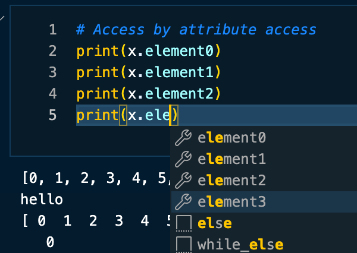

# `R` style `list` class in `Python`

- I made this JUST FOR FUN! 
- You can use `Rist` class to create a list-like object in Python.
- It allows you to access elements by name, similar to R's named lists.
- The most easy way is to use attribute access.
- Of course, it also supports access by index.
- You can contain any type of object, including other `Rist` objects, even.


```python
import main
```

### Basic Usage


```python
import numpy as np
import pandas as pd

x = main.Rist(
    element0 = [i for i in range(50)],
    element1 = "hello",
    element2 = np.arange(20),
    element3 = pd.DataFrame([1,2,3])
)

```


```python
# Print the object
print(x)
```

    .(Rist)
        ├── .element0 (list)
        │   [0, 1, 2, 3, 4, 5, 6, 7, 8, 9, 10, 11, 12, 13, 14, 15, 16, 17, 18, 19, 20, 21, 22, 23, 24, 25, 26, 27, 28, 29, 30, 31, 32, 33, 34, 35, 36, 37, 38, 39, 40, 41, 42, 43, 44, 45, 46, 47, 48, 49]
        ├── .element1 (str)
        │   'hello'
        ├── .element2 (ndarray)
        │   array([ 0,  1,  2,  3,  4,  5,  6,  7,  8,  9, 10, 11, 12, 13, 14, 15, 16,
        │          17, 18, 19])
        └── .element3 (DataFrame)
               0
            0  1
            1  2
            2  3


```python
# names, values
print(x.names)
print(x.values)
```

    ['element0', 'element1', 'element2', 'element3']
    [[0, 1, 2, 3, 4, 5, 6, 7, 8, 9, 10, 11, 12, 13, 14, 15, 16, 17, 18, 19, 20, 21, 22, 23, 24, 25, 26, 27, 28, 29, 30, 31, 32, 33, 34, 35, 36, 37, 38, 39, 40, 41, 42, 43, 44, 45, 46, 47, 48, 49], 'hello', array([ 0,  1,  2,  3,  4,  5,  6,  7,  8,  9, 10, 11, 12, 13, 14, 15, 16,
           17, 18, 19]),    0
    0  1
    1  2
    2  3]


## Accessing Methods

### Attribute

You can use `tab` to check elements in tooltip!



```python
# Access by attribute access
print(x.element0)
print(x.element1)
print(x.element2)
print(x.element3)
```

    [0, 1, 2, 3, 4, 5, 6, 7, 8, 9, 10, 11, 12, 13, 14, 15, 16, 17, 18, 19, 20, 21, 22, 23, 24, 25, 26, 27, 28, 29, 30, 31, 32, 33, 34, 35, 36, 37, 38, 39, 40, 41, 42, 43, 44, 45, 46, 47, 48, 49]
    hello
    [ 0  1  2  3  4  5  6  7  8  9 10 11 12 13 14 15 16 17 18 19]
       0
    0  1
    1  2
    2  3


### Name


```python
# Access by name
print(x['element0'])
print(x['element1'])
print(x['element2'])
print(x['element3'])
```

    [0, 1, 2, 3, 4, 5, 6, 7, 8, 9, 10, 11, 12, 13, 14, 15, 16, 17, 18, 19, 20, 21, 22, 23, 24, 25, 26, 27, 28, 29, 30, 31, 32, 33, 34, 35, 36, 37, 38, 39, 40, 41, 42, 43, 44, 45, 46, 47, 48, 49]
    hello
    [ 0  1  2  3  4  5  6  7  8  9 10 11 12 13 14 15 16 17 18 19]
       0
    0  1
    1  2
    2  3


### Index


```python
# Access by index
print(x[0])
print(x[1])
print(x[2])
print(x[3])
```

    [0, 1, 2, 3, 4, 5, 6, 7, 8, 9, 10, 11, 12, 13, 14, 15, 16, 17, 18, 19, 20, 21, 22, 23, 24, 25, 26, 27, 28, 29, 30, 31, 32, 33, 34, 35, 36, 37, 38, 39, 40, 41, 42, 43, 44, 45, 46, 47, 48, 49]
    hello
    [ 0  1  2  3  4  5  6  7  8  9 10 11 12 13 14 15 16 17 18 19]
       0
    0  1
    1  2
    2  3


## `Rist` in `Rist` in `Rist` ...


```python
Rist1 = main.Rist(
    Rist2 = main.Rist(
        Rist3 = main.Rist(
            string = "Hello World",
            df2    = pd.DataFrame({'Hello': [0,1,0], 'World': [1,0,1]})
        ),
        list2 = [2,3,5,7],
        arr1  = np.arange(5)
    ),
    list1 = [1,3,5,7],
    df1   = pd.DataFrame({'a': [1,2,3,4], 'b': [5,6,7,8]})
)
```


```python
print(Rist1)
```

    .(Rist)
        ├── .Rist2 (Rist)
        │   ├── .Rist3 (Rist)
        │   │   ├── .string (str)
        │   │   │   'Hello World'
        │   │   └── .df2 (DataFrame)
        │   │          Hello  World
        │   │       0      0      1
        │   │       1      1      0
        │   │       2      0      1
        │   ├── .list2 (list)
        │   │   [2, 3, 5, 7]
        │   └── .arr1 (ndarray)
        │       array([0, 1, 2, 3, 4])
        ├── .list1 (list)
        │   [1, 3, 5, 7]
        └── .df1 (DataFrame)
               a  b
            0  1  5
            1  2  6
            2  3  7
            3  4  8

